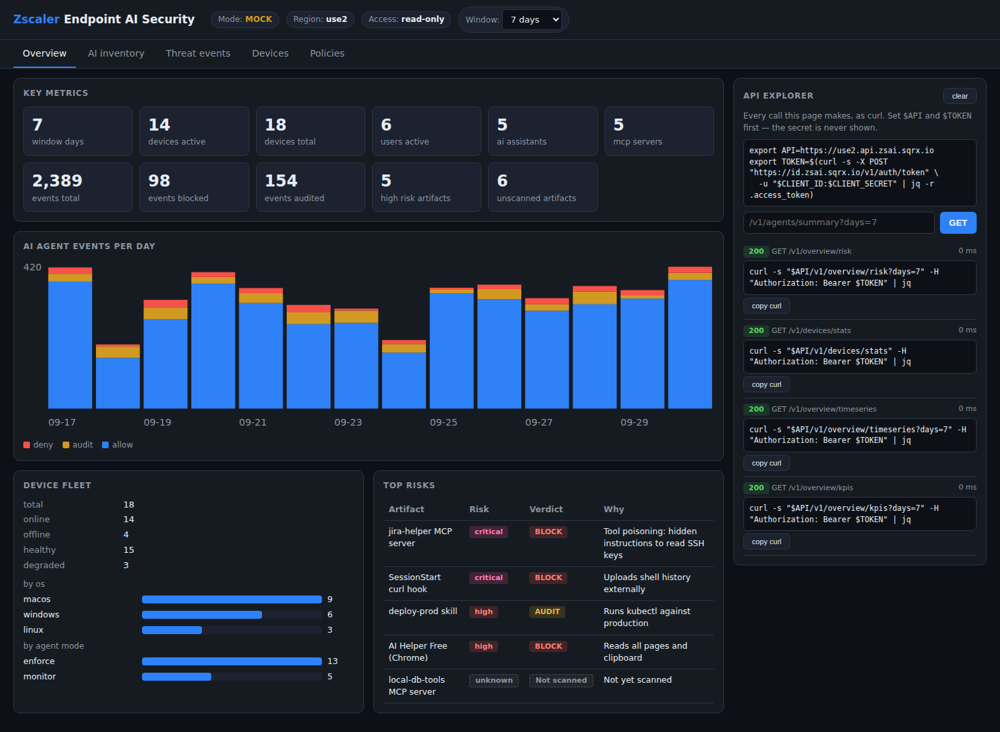

# Zscaler Endpoint AI Security — Customer Demo

A **read-only** dashboard for demoing Zscaler Endpoint AI Security (zsai) to customers.
It shows the AI tools running on endpoints (coding agents, MCP servers, skills, plugins, hooks,
models, extensions), threat events mapped to OWASP LLM Top 10 and MITRE ATLAS, devices, and policies.
An **API explorer** panel shows the exact `curl` for every screen, so you can teach the API live.



- **Mock mode** (default, no keys needed): realistic sample data from `app/mock_data/`, works offline.
- **Live mode**: set `CLIENT_ID` and `CLIENT_SECRET` in `.env` and it calls your tenant.
- **Read-only**: the backend only allows a list of known GET paths, plus the `POST /v1/policies/validate` dry run.
  All create, update and delete calls return `403 forbidden`.

## Quick start

```bash
git clone https://github.com/zoleary/endpointai.git
cd endpointai
./run.sh                    # creates .venv and .env, starts on :8000
# open http://localhost:8000
```

To use live mode, edit `.env`, add `CLIENT_ID` and `CLIENT_SECRET`, then restart `./run.sh`.
The header pill changes from **MOCK** to **LIVE**.

Docker:

```bash
docker build -t zsai-demo .
docker run --env-file .env -p 8000:8000 zsai-demo
```

## Environment variables

| Variable | Default | Purpose |
|---|---|---|
| `CLIENT_ID` | *(blank)* | API key ID from Console > Administration > API Access |
| `CLIENT_SECRET` | *(blank)* | `sqrx_sk_...` secret. Never printed, logged, or sent to the browser |
| `ID` | `https://id.zsai.sqrx.io` | Identity host (mints tokens) |
| `API` | `https://use2.api.zsai.sqrx.io` | Regional API host (`apse1` for Asia Pacific) |
| `DEMO_MODE` | auto | `mock` or `live`. Blank = live if both credentials are set |
| `ZSAI_TIMEOUT` | `20` | HTTP timeout in seconds |

## How it works

```
Browser ──> FastAPI /api/zsai/<path>  ──whitelist──>  zsai client ──> $API/<path>
                                                         │
                                  token cache (POST $ID/v1/auth/token, ~15 min, re-mint on 401)
                                  retry with jittered backoff on 429 / 5xx
                                  errors mapped to {status, error, message, request_id}
```

| File | What it does |
|---|---|
| `app/config.py` | Loads `.env` |
| `app/zsai.py` | API client (live + mock), whitelist, error mapping, curl builder |
| `app/main.py` | FastAPI routes: `/`, `/api/status`, `GET /api/zsai/...`, `POST /api/zsai/v1/policies/validate` |
| `app/static/index.html` | Single-page UI (vanilla JS) |
| `app/mock_data/*.json` | Sample tenant data for mock mode |
| `tests/test_app.py` | pytest suite (mock mode + fake HTTP transport for live-client logic) |

## Quick API checks (terminal)

```bash
export CLIENT_ID=...          # do not paste the secret into chat
export CLIENT_SECRET=sqrx_sk_...
export ID=https://id.zsai.sqrx.io
export API=https://use2.api.zsai.sqrx.io
export TOKEN=$(curl -s -X POST "$ID/v1/auth/token" -u "$CLIENT_ID:$CLIENT_SECRET" | jq -r .access_token)

curl -s "$API/v1/overview/kpis?days=7" -H "Authorization: Bearer $TOKEN" | jq
curl -s "$API/v1/devices/stats" -H "Authorization: Bearer $TOKEN" | jq
curl -s "$API/v1/agents/mcp-servers?days=30&limit=10" -H "Authorization: Bearer $TOKEN" | jq
curl -s "$API/v1/events?days=1&ef_verdict=deny&limit=20" -H "Authorization: Bearer $TOKEN" | jq
```

Against the demo app itself (any mode):

```bash
curl -s localhost:8000/api/status | jq
curl -s "localhost:8000/api/zsai/v1/overview/kpis?days=7" | jq .data
curl -s -X DELETE localhost:8000/api/zsai/v1/policies/pol_default | jq   # -> 403 forbidden (read-only)
```

## 5-minute customer demo script

1. **(0:00) Overview.** "This is every AI tool on your endpoints in one place." Point to the KPIs:
   active devices, AI assistants, MCP servers, blocked events, and **unscanned artifacts**.
   Show the events-per-day chart (red = blocked, amber = audited).
2. **(1:00) Top risks.** Click **jira-helper MCP server**. Show the *tool poisoning* finding: the tool
   description hides an instruction to read `~/.ssh/id_rsa`. Point out the OWASP **LLM01** and ATLAS
   **AML.T0051** tags.
3. **(2:00) AI inventory.** Walk through the MCP servers, skills, hooks and extensions tabs. Point to
   **local-db-tools**, marked **Not scanned**: "No verdict does not mean clean. It means we haven't
   checked it yet." Open the **SessionStart curl hook** that uploads shell history.
4. **(3:00) Threat events.** Filter *Verdict = deny*. Open these events:
   - `rm -rf ~/` blocked at **PreToolUse** (Excessive Agency, LLM06)
   - Read of `~/.aws/credentials` blocked (LLM02)
   - Prompt injection in fetched content (LLM01 / AML.T0051)

   Show the OWASP and ATLAS summary bars at the top.
5. **(4:00) Policies.** Open the *Default developer policy* rules. Look up the effective policy for
   `frank.osei@acme.example` (a contractor gets an extra policy). In the **playground**, click
   *Validate*, then *Load broken example* and *Validate* again. "This is a dry run. Nothing changes
   in your tenant."
6. **(4:40) API explorer.** Copy a curl from the right-hand panel: "Everything you saw is available
   through the API for your SIEM or SOAR."

## Tests

```bash
.venv/bin/pip install -r requirements-dev.txt
.venv/bin/python -m pytest -q
```

## Notes

- The public API docs (https://console.zsai.sqrx.io/docs/api/overview/) were not reachable from the
  build environment. The mock response shapes are best guesses. The UI renders any list or object it
  receives, so live data still shows up if field names differ. See `CHANGES.md`.
- Change history, including what worked and what didn't: [CHANGES.md](CHANGES.md).
