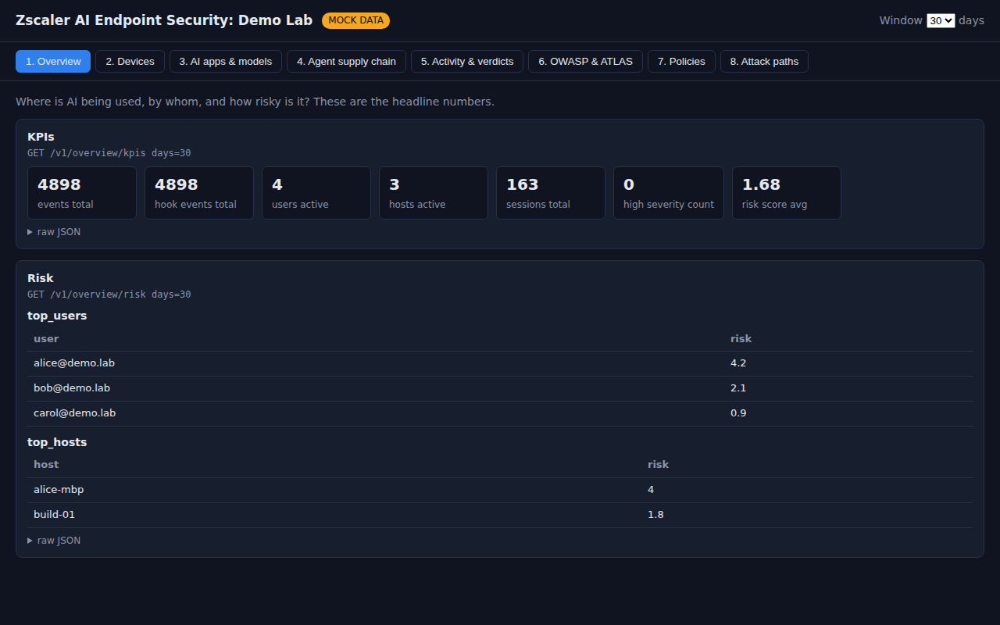

# endpointai: Zscaler AI Endpoint Security demo lab

A small lab for demoing **Zscaler Endpoint AI Security** to customers:

- **Dashboard (Docker):** one web page with eight demo scenes, backed by the live zsai API (read-only), with mock data as a fallback.
- **Endpoint kit:** builds a safe `~/zsai-demo` workspace on your enrolled Mac, with fake secrets, a normal and a poisoned MCP server, a risky skill and a suspicious hook, so the guardrails have something to catch.
- **Talk track + console settings:** [`docs/TALK_TRACK.md`](docs/TALK_TRACK.md)



## Quick start (Mac with Docker Desktop)

```bash
cd endpointai
cp .env.example .env          # then edit .env: set CLIENT_ID and CLIENT_SECRET
docker compose up -d --build
open http://localhost:8080    # the badge should say LIVE
```

If you leave `.env` empty, the dashboard runs in **mock** mode with sample data.

## Build the endpoint lab (on the enrolled Mac, not in Docker)

```bash
./endpoint-kit/setup-lab.sh --with-hook
cd ~/zsai-demo && claude      # approve both MCP servers when asked
```

Then follow scene 5 of the talk track. Remove the lab with `./endpoint-kit/cleanup-lab.sh`.

## Helper scripts (read `CLIENT_ID` / `CLIENT_SECRET` from `.env`)

| Script | What it does |
|---|---|
| `scripts/snapshot.sh` | Read-only. Saves your current policies, settings and groups to `snapshot/` |
| `scripts/watch-events.sh [block]` | Read-only. Shows the 10 latest agent events |
| `scripts/create-policies.sh` | Dry-run all lab policies. Add `--apply` to create them (asks first for each one) |
| `scripts/validate-policy.sh <file>` | Dry-run one policy |

## Safety

- The dashboard only makes **GET** calls, and only to a fixed list of paths.
- The secret stays in `.env`, which git and Docker ignore. It's never logged or returned to the browser.
- Port 8080 is bound to `127.0.0.1`, so only your Mac can reach it.
- Lab secrets are AWS's published example keys and dummy values. The demo hook targets a `.invalid` host, which never resolves.

## Develop

```bash
pip install -r requirements-dev.txt
pytest -q
uvicorn app.main:app --reload --port 8080
```
